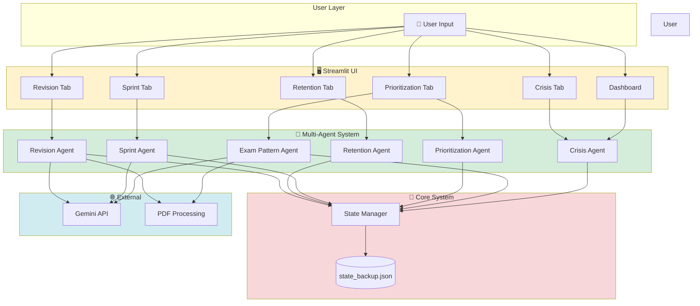
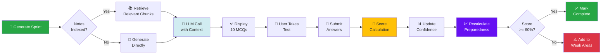
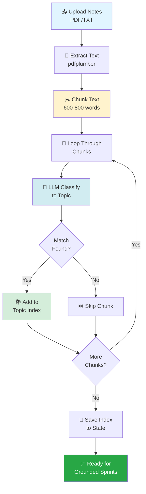

# 🎯 CramClutch

> **Multi-Agent Exam Crisis Coordinator**

Smart, adaptive AI system that transforms panic-driven last-minute studying into strategic, data-driven exam preparation using multi-agent architecture.

[](https://www.python.org/)
[](https://streamlit.io/)
[](https://ai.google.dev/)
[]()
[]()
[](https://opensource.org/licenses/MIT)

---

## 📚 Problem Statement

### The Last-Minute Cramming Crisis

Students preparing for exams in the final 4–24 hours face a critical challenge:

- ⏰ **Time Pressure**: Overwhelming syllabus with minimal time
- 🎯 **Unknown Priorities**: Which topics are actually important?
- 😰 **Cognitive Overload**: Random studying leads to panic and inefficiency
- ❓ **No Feedback**: Self-assessment is biased and unreliable
- 📉 **Poor Retention**: Passive reading doesn't build real confidence

**Traditional approach** = panic-driven, unstructured cramming with zero objective measurement.

**What students need** = structured, adaptive workflow that focuses on high-yield topics with objective performance tracking.

---

## 💡 Solution Overview

**CramClutch** is an intelligent exam preparation system powered by **6 specialized AI agents** that work together to:

### 🧠 Core Intelligence

- **📊 Model Stress**: Calculate **PSI (Preparation Stress Index)** based on time remaining, syllabus coverage, and confidence gaps
- **🔍 Analyze Patterns**: Extract questions from previous year papers using PDF analysis
- **🎯 Detect High-Yield Topics**: Automatically discover topics from uploaded papers using LLM classification
- **⚡ Generate Smart Sprints**: Create focused 10-MCQ study sessions with active recall questions
- **📈 Measure Retention**: Objective confidence scoring through MCQ performance (no self-reporting bias)
- **📋 Quick Revision**: Ultra-concise bullet-point notes for last-minute review with downloadable PDF

### 🚀 Advanced Features

- **RAG (Retrieval-Augmented Generation)**: Upload your own study notes → system chunks and indexes them by topic → generates grounded sprints based on *your material* (reduced hallucination)
- **Adaptive Prioritization**: Combines exam probability, confidence levels, time pressure, and PSI to rank topics dynamically
- **Efficiency First**: Caches sprints and revision notes, tracks submission history to prevent score inflation, uses chunked retrieval to minimize API costs (~70% reduction)

---

## 🏗️ Multi-Agent Architecture

CramClutch uses a **specialized agent system** where each agent is an expert in one domain:

### 1️⃣ Crisis Agent

**Role**: Assess urgency and calculate stress level

**Inputs**:
- Time remaining until exam
- Syllabus coverage percentage
- Confidence scores per topic

**Outputs**:
- **PSI (Preparation Stress Index)**: 0.0 to 1.0
- Crisis level: `normal` | `moderate` | `high` | `critical`
- Actionable recommendation

**Formula**:
```
PSI = (time_pressure × 0.5) + (coverage_gap × 0.3) + (confidence_gap × 0.2)
```

---

### 2️⃣ Exam Pattern Agent

**Role**: Analyze historical exam patterns and extract questions

**Inputs**:
- University name (e.g., JNTU, Osmania)
- Previous year question paper PDFs

**Outputs**:
- Exam probability map (topic → historical weightage)
- Extracted questions list
- Dynamically discovered topics from papers

**How it works**: Uses `pdfplumber` to extract text, regex patterns to detect questions, and LLM to classify topics.

---

### 3️⃣ Prioritization Agent

**Role**: Rank topics by strategic importance

**Inputs**:
- Exam probability map (from Exam Pattern Agent)
- Confidence scores (from Retention Agent)
- PSI (from Crisis Agent)
- Time remaining

**Outputs**:
- Priority scores per topic
- Ranked topic list (high → low priority)

**Algorithm**:
```
priority = (exam_probability × 0.4) + (weakness × 0.3) + (time_boost × 0.2) + (psi × 0.1)
```

---

### 4️⃣ Sprint Agent

**Role**: Generate focused study sprints with MCQ testing

**Inputs**:
- Topic name
- Optional: Relevant chunks from user's notes (RAG)

**Outputs**:
```json
{
  "summary": "2-minute concise explanation",
  "active_recall_questions": ["Q1", "Q2", "Q3", "Q4"],
  "application_question": "Scenario-based problem",
  "mcqs": [
    {"question": "...", "options": ["A", "B", "C", "D"], "answer": "A"},
    // ... exactly 10 MCQs
  ]
}
```

**Key Feature**: If notes are indexed, retrieves relevant chunks and includes them in the prompt for **grounded content generation**.

---

### 5️⃣ Retention Agent

**Role**: Track confidence levels and identify weak areas

**Inputs**:
- Topic name
- MCQ performance score (0.0 to 1.0)

**Outputs**:
- Updated confidence score per topic
- **Preparedness score**: Weighted average confidence (weighted by exam probability)
- Weak areas list (topics with confidence < 0.5)

**Formula**:
```
preparedness = Σ(confidence[topic] × exam_probability[topic]) / Σ(exam_probability)
```

---

### 6️⃣ Revision Agent

**Role**: Generate ultra-concise revision notes

**Inputs**:
- Top 3-5 priority topics

**Outputs**:
- Bullet-point notes per topic (max 6 bullets each)
- Downloadable PDF with styled formatting

**Efficiency**: Single LLM call for all topics (batch processing), cache with hash validation to avoid regeneration.

---

### 7️⃣ Notes Indexing (RAG Component)

**Role**: Make uploaded study notes searchable by topic

**Process**:
1. **Upload** PDF/TXT notes
2. **Extract** text using `pdfplumber`
3. **Chunk** into 600-800 word segments (sentence boundary detection)
4. **Classify** each chunk to a topic using LLM
5. **Index**: Build `{topic: [chunk1, chunk2, ...]}` mapping
6. **Retrieve**: During sprint generation, fetch relevant chunks for context

**Benefit**: LLM generates content grounded in student's own notes → reduced hallucination.

---

## 📐 Architecture Diagrams

### High-Level System Architecture



---

### Sprint Execution Flow



---

### RAG (Notes Indexing) Flow



---

## ✨ Key Features

### 🎯 Intelligence & Analysis
- **Panic Severity Index (PSI)**: Quantifies urgency based on time, coverage, and confidence
- **Dynamic Topic Discovery**: Automatically extracts topics from uploaded PDFs using LLM
- **Smart Prioritization Engine**: Multi-factor ranking (exam probability + weakness + time pressure + PSI)
- **Historical Pattern Analysis**: Uses university-specific exam weightage data

### 📊 Performance Tracking
- **Objective MCQ Evaluation**: No self-reported bias—confidence measured by actual test scores
- **Performance-Based Retention Scoring**: Confidence updates based on quiz performance
- **Submission History Tracking**: Prevents score inflation on retakes (only first success counts toward study time)
- **Preparedness Score**: Weighted average showing overall exam readiness

### ⚡ Efficiency & UX
- **Cached API Calls**: Sprint and revision caching reduces API costs by ~70%
- **RAG-Based Grounding**: Upload your notes → chunked, indexed, and used for personalized content
- **Quick Revision Notes**: Ultra-concise bullet points with downloadable PDF export
- **Persistent Session State**: All data saved to `state_backup.json` across sessions
- **MCQ Structure Validation**: Pre-submission checks prevent crashes from malformed LLM responses

### 🎓 Customization
- **Custom University Support**: Add your university's exam patterns via JSON
- **Optional Syllabus Topics**: Manually enter topics or auto-discover from papers
- **Notes Upload**: PDF/TXT support for personalized content generation

### 🛡️ Safety & Reliability
- **Submission Lock Mechanism**: Prevents double-submit bugs
- **Hash-Based Cache Invalidation**: Revision notes regenerate only when topics change
- **Fallback Logic**: Ranked topics gracefully degrade to intelligence.topics if unavailable
- **Error Handling**: Warning messages for save failures (no silent failures)

---

## 🛠️ Tech Stack

| Component | Technology |
|-----------|-----------|
| **Backend** | Python 3.8+ |
| **Frontend** | Streamlit 1.28+ |
| **LLM** | Google Gemini API (gemini-2.5-flash-lite) |
| **PDF Extraction** | PDFPlumber |
| **PDF Generation** | ReportLab |
| **State Management** | JSON-based persistence |
| **Documentation** | Mermaid diagrams |

---

## 🚀 Installation & Setup

### 1️⃣ Clone the Repository

```bash
git clone https://github.com/Yaser-123/CramClutch.git
cd CramClutch
```

### 2️⃣ Create Virtual Environment

**Windows:**
```bash
python -m venv venv
venv\Scripts\activate
```

**macOS/Linux:**
```bash
python3 -m venv venv
source venv/bin/activate
```

### 3️⃣ Install Dependencies

```bash
pip install -r requirements.txt
```

### 4️⃣ Configure Environment Variables

Create a `.env` file in the project root:

```env
# Required: Get your API key from https://ai.google.dev/
GEMINI_API_KEY=your_gemini_api_key_here
```

**Alternative**: Set as system environment variable or pass via Streamlit secrets.

### 5️⃣ Run the Application

```bash
streamlit run app.py
```

The app will open in your browser at `http://localhost:8501`

---

## ⚙️ API Efficiency & Safety

### Cost Optimization Strategies

CramClutch implements **7 mechanisms** to minimize API calls and reduce costs by ~70%:

#### 1. Sprint Caching
```python
generated_sprints = {"OS": {...}, "Networks": {...}}
if topic in generated_sprints:
    return cached_sprint  # No API call
```

#### 2. Revision Cache with Hash Validation
```python
topics_hash = hash(tuple(sorted(selected_topics)))
if cached_notes and cached_meta['topics_hash'] == topics_hash:
    return cached_notes  # No regeneration
```

#### 3. Single-Call Revision Generation
- **Bad**: 5 topics → 5 API calls
- **Good**: 5 topics → 1 batch API call (80% cost reduction)

#### 4. Limited Context in Chunk Classification
```python
llm_classify(chunk[:1000])  # Send first 1000 chars only
```

#### 5. Submission History Tracking
```python
submission_history = {"OS": {"attempts": 2, "best_score": 0.8}}
# Only first successful attempt adds study time
```

#### 6. Notes Index Caching
- Index notes once → reuse across sessions
- Avoids re-classifying 50+ chunks on every load

#### 7. Structured Prompts
- Clear format requirements reduce parsing failures
- Less regeneration needed

### Safety Mechanisms

- **MCQ Structure Validation**: Pre-submission checks (question, 4 options, answer A/B/C/D)
- **Submission Lock**: Prevents double-submit during processing
- **Fallback Logic**: Graceful degradation when data missing
- **Warning Messages**: Save failures logged (no silent errors)

---

## ⚠️ Limitations

### Current Constraints

- **No OCR Support**: Scanned PDFs with images won't extract properly (text-based PDFs only)
- **API Dependency**: Requires active Gemini API key and internet connection
- **Lightweight RAG**: Uses chunking + LLM classification instead of vector embeddings (simpler but less semantic)
- **Sequential Chunk Processing**: Notes indexing processes chunks one-by-one (parallelization possible in future)
- **Single User**: No multi-user or collaborative features yet

### Known Issues

- Large PDF uploads (>50 pages) may take time to process
- Topic fuzzy matching occasionally misclassifies edge cases
- Revision PDF styling is basic (functional but not fancy)

---

## 🔮 Future Improvements

### Planned Enhancements

- **Vector Embeddings**: Replace LLM classification with semantic similarity search (FAISS/ChromaDB)
- **Adaptive Spaced Repetition**: Forgetting curve-based revision scheduling
- **Collaborative Study Mode**: Multi-user sessions with shared sprints
- **Mobile Optimization**: Responsive design for smartphone studying
- **Advanced Analytics Dashboard**: Charts showing progress trends over time
- **OCR Integration**: Support for scanned PDF papers (Tesseract)
- **Multi-Language Support**: Hindi, Telugu, Tamil exam preparation
- **Custom Quiz Generation**: Upload syllabus → auto-generate full practice tests
- **Export Options**: ANKI flashcards, Notion database, Obsidian markdown
- **Performance Prediction**: ML model to predict exam score based on preparedness

### Technical Debt

- Parallel chunk classification for faster indexing
- Database migration (SQLite/PostgreSQL) for better state management
- Rate limiting and retry logic for API calls
- Unit tests and integration tests
- CI/CD pipeline for deployment

---

## 🌐 Live Demo

**Try CramClutch now**: [https://cramclutch.streamlit.app/](https://cramclutch.streamlit.app/)

> Experience the full multi-agent exam preparation system in action!

---

## 📄 License

This project is licensed under the **MIT License**.

```
MIT License

Copyright (c) 2026 CramClutch Contributors

Permission is hereby granted, free of charge, to any person obtaining a copy
of this software and associated documentation files (the "Software"), to deal
in the Software without restriction, including without limitation the rights
to use, copy, modify, merge, publish, distribute, sublicense, and/or sell
copies of the Software, and to permit persons to whom the Software is
furnished to do so, subject to the following conditions:

The above copyright notice and this permission notice shall be included in all
copies or substantial portions of the Software.

THE SOFTWARE IS PROVIDED "AS IS", WITHOUT WARRANTY OF ANY KIND, EXPRESS OR
IMPLIED, INCLUDING BUT NOT LIMITED TO THE WARRANTIES OF MERCHANTABILITY,
FITNESS FOR A PARTICULAR PURPOSE AND NONINFRINGEMENT. IN NO EVENT SHALL THE
AUTHORS OR COPYRIGHT HOLDERS BE LIABLE FOR ANY CLAIM, DAMAGES OR OTHER
LIABILITY, WHETHER IN AN ACTION OF CONTRACT, TORT OR OTHERWISE, ARISING FROM,
OUT OF OR IN CONNECTION WITH THE SOFTWARE OR THE USE OR OTHER DEALINGS IN THE
SOFTWARE.
```

---

## 🤝 Contributing

Contributions are welcome! Please:

1. Fork the repository
2. Create a feature branch (`git checkout -b feature/amazing-feature`)
3. Commit your changes (`git commit -m 'Add amazing feature'`)
4. Push to the branch (`git push origin feature/amazing-feature`)
5. Open a Pull Request

---

## 📧 Contact & Support

- **GitHub Issues**: [Report bugs or request features](https://github.com/Yaser-123/CramClutch/issues)
- **Documentation**: See [DOCUMENTATION.md](DOCUMENTATION.md) for detailed technical docs
- **Email**: [Your contact email]

---

## 🙏 Acknowledgments

- **Streamlit** for the amazing framework
- **Google Gemini** for powerful LLM capabilities
- **PDFPlumber** for reliable PDF extraction
- All students who inspired this project during exam crunch time 📚

---

<div align="center">

**Built with ❤️ for students everywhere**

⭐ Star this repo if CramClutch helped you ace your exams!

</div>
